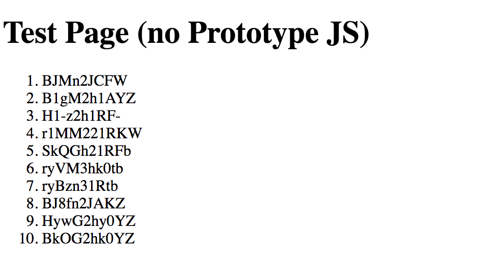
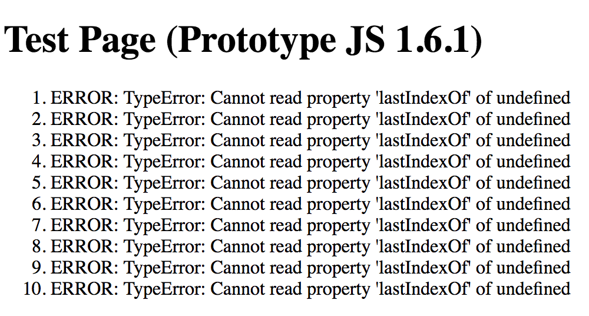

# shortid-test

Demonstrate an issue with [shortid](https://www.npmjs.com/package/shortid) when used with PrototypeJS 1.6 or earlier.

## Install
```
npm install
```

## Test
Builds (with webpack) and opens test.html, test-prototype.html in browser
```
npm test
```

## Results

### test.html (Without Prototype)


### test-prototype.html (With Prototype 1.6)

